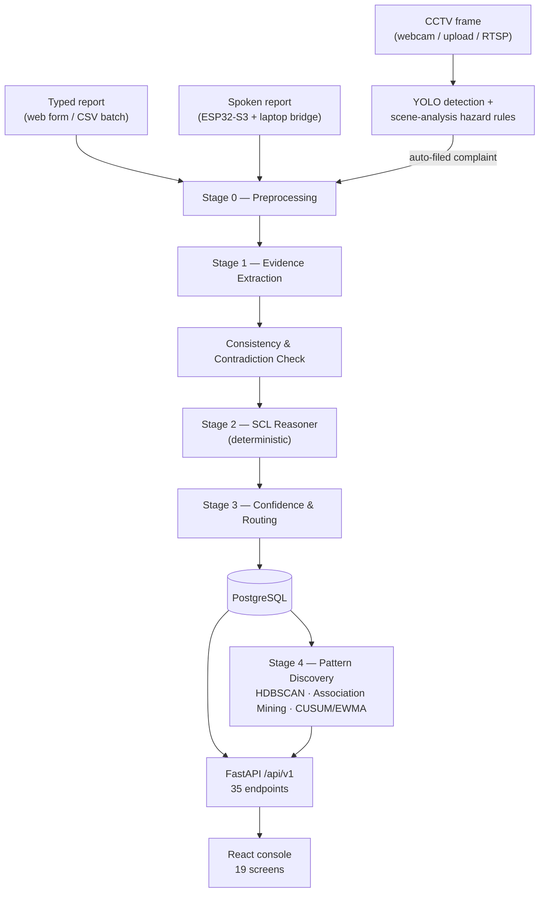

# Sentinel

**AI/NLP Engine for Serious Injury & Fatality (SIF) Precursor Detection**
SIH 2026 · Problem Statement 26165 · Oil India Limited (OIL)

Sentinel reads free-text unsafe-act / unsafe-condition and near-miss reports from an
upstream oil & gas operation and identifies which ones describe a situation that
**carried credible potential for a fatality or life-altering injury — regardless of
what actually happened.** It explains every verdict in the vocabulary an HSE
engineer already uses (energy, barrier, exposure, Life-Saving Rule), routes
low-confidence cases to a human instead of guessing, and surfaces the recurring
failure patterns and interventions behind them. Two additional intake channels —
CCTV hazard monitoring and spoken voice reports from an ESP32 field device — feed
the same reasoning engine rather than running a second, different one.

> **This README is written against the code in this repository, not against a
> plan for it.** Every model name, metric, threshold and file path below was read
> out of source or a generated report before being written down. The
> [no-hallucination audit](#32-no-hallucination-audit) at the end lists what was
> checked.

---

## Table of contents

1. [Problem statement](#1-problem-statement)
2. [Why this problem matters](#2-why-this-problem-matters)
3. [The core insight](#3-the-core-insight-potential-severity--actual-outcome)
4. [What Sentinel does](#4-what-sentinel-does)
5. [End-to-end architecture](#5-end-to-end-architecture)
6. [The pipeline, stage by stage](#6-the-pipeline-stage-by-stage)
7. [NLP / ML architecture](#7-nlp--ml-architecture)
8. [Explainability architecture](#8-explainability-architecture)
9. [Live Safety Vision (computer vision)](#9-live-safety-vision-computer-vision)
10. [ESP32 voice node (IoT layer)](#10-esp32-voice-node-iot-layer)
11. [Backend architecture](#11-backend-architecture)
12. [Frontend / console](#12-frontend--console)
13. [Database](#13-database)
14. [Pattern discovery](#14-pattern-discovery)
15. [Intervention & action-plan tracking](#15-intervention--action-plan-tracking)
16. [Technology stack](#16-technology-stack)
17. [Data and the synthetic-data disclaimer](#17-data-and-the-synthetic-data-disclaimer)
18. [Model & evaluation results](#18-model--evaluation-results)
19. [API overview](#19-api-overview)
20. [Repository structure](#20-repository-structure)
21. [Setup](#21-setup)
22. [Running the project](#22-running-the-project)
23. [Testing](#23-testing)
24. [Deployment architecture](#24-deployment-architecture)
25. [Security & authentication](#25-security--authentication)
26. [Limitations](#26-limitations)
27. [Future production pathway](#27-future-production-pathway)
28. [Research references](#28-research-references)
29. [Team & credits](#29-team--credits)
30. [Status ledger](#30-status-ledger)
31. [Honesty section](#31-honesty-section)
32. [No-hallucination audit](#32-no-hallucination-audit)

---

## 1. Problem statement

> **AI/NLP Engine to Detect Serious Injury & Fatality (SIF) Precursors in OIL's
> Unsafe-Act/Unsafe-Condition and Near-Miss Reports** — SIH 2026, PS 26165, Oil
> India Limited.

OIL, like every upstream operator, collects thousands of free-text HSSE
observations a year. The overwhelming majority describe minor issues. Buried
inside that volume are a small number of reports that describe a situation which
could easily have killed someone, and where it didn't is mostly a matter of luck
— a dropped tool that missed, a gap that nobody happened to walk into that shift.
Those reports carry a different kind of signal than an injury log, and a human
reviewer skimming a spreadsheet full of routine housekeeping entries is not a
reliable way to find them.

## 2. Why this problem matters

Serious-injury-and-fatality (SIF) research (DEKRA's Martin & Black studies, the
EEI Safety Classification and Learning — SCL — model) established that the
precursors to a fatality are identifiable from the situation itself: was a
high-energy source present, was a person exposed to it, and did an effective
barrier stand between them. **Actual outcome is a poor predictor of this** — an
overwhelming majority of high-potential events are captured in "no injury" or
"first aid" reports, because a fatal outcome requires the hazard, the exposure,
*and* no intervening barrier all at once, which is comparatively rare even when
the first two conditions are common. A detection system trained to recognise
"reports that read like past injuries" structurally misses this majority. A
system has to be evaluated against **potential**, not outcome, to be useful for
the thing SIF prevention actually needs: finding the near-misses that were close
calls before the close call becomes a fatality.

## 3. The core insight: potential severity ≠ actual outcome

```
Actual injury severity  !=  Potential severity
```

A dropped wrench that lands 30 cm from a boot is a "no injury" event by outcome
and a live high-energy precursor by exposure. A sprained wrist from a wet-floor
slip is a real recordable injury and, on the SCL model, usually *not* a
precursor — low energy, however painful. Sentinel's reasoning chain is built to
answer "what was the *potential*" rather than "how bad was the outcome":

```
Activity → Hazard / Energy → Exposure → Barrier / Control State
  → Credible Consequence → SIF Potential → IOGP Life-Saving Rule
  → Site-level Safety Intelligence
```

## 4. What Sentinel does

| Capability | What it is |
|---|---|
| Report-analysis pipeline | Free-text UA/UC/near-miss report in → structured evidence, a SIF-potential verdict, a Life-Saving Rule tag, a confidence-routed review bucket, and a plain-language justification out. |
| Camera Watch (Live Safety Vision) | Real-time YOLO object detection + classical-CV scene analysis over a webcam, uploaded video, or RTSP stream, with a rule layer that turns what the camera saw into the same kind of report a person would type — filed automatically into the same review queue. |
| Voice reporting | An ESP32-S3 field device captures a spoken report; a laptop-side bridge transcribes it locally and submits it through the identical classification path a typed report uses. |
| Pattern discovery | Recurring failure patterns across the corpus, clustered on the *extracted event frame* rather than wording, plus statistically-grounded early-warning trend detection. |
| Intervention engine | A curated, version-controlled hierarchy-of-controls library maps each detected pattern to ranked, auditable recommended controls. |
| Console | A 19-screen React dashboard — reports, review queue, camera watch, operations map, patterns, barrier failures, life-saving rules, interventions, trends, model performance, audit trail — all reading live data from one API. |

## 5. End-to-end architecture



**The one decision that shapes everything else:** the live pipeline never asks a
trained classifier "is this a SIF precursor?" directly. It extracts structured
evidence, then runs that evidence through a small, fixed, auditable decision
structure. A separate, rigorously benchmarked ladder of learned classifiers
(§7, §18) exists to establish that the approach is technically sound and to
give a migration path — but the verdict a reviewer sees today came out of the
rule engine, not a model's probability score. This is stated plainly rather
than left to be discovered, because the two are easy to conflate and the
difference is the whole explainability argument (§8).

## 6. The pipeline, stage by stage

All of Stages 0–3 live under `aiml/src/sif_engine/` and are exercised by
`sif_engine.pipeline.run_single()` / `run_batch()`, which the backend calls on
every ingest.

| Stage | Module | What it does | Nature |
|---|---|---|---|
| **0 — Preprocessing** | `preprocessing/` | Abbreviation expansion (`LOTO`→lockout/tagout, `PTW`→permit to work, …), code-mixed-text normalisation, typo repair, whitespace cleanup. | Deterministic |
| **1 — Evidence extraction** | `extraction/evidence_extractor.py`, `extraction/energy_classifier.py` | Regex/gazetteer matching against the shared ontology (`configs/ontology.yaml`) to pull activity, hazard, exposure, barrier + barrier status, location — each with a character span into the **raw, un-preprocessed** text, plus a high-energy gate and descriptive energy-type label. | Deterministic (see box below) |
| **Consistency check** | `reasoning/consistency.py` | Flags factual contradictions (e.g. "area cleared" vs. "worker directly under load"; isolation "confirmed" vs. "energised equipment exposed"). Explicitly **preserves** "no injury occurred" + direct high-energy exposure as a valid precursor rather than flagging it as a contradiction — this is the mechanism that keeps the outcome-independence promise in §3 from being undone downstream. | Deterministic |
| **2 — SCL reasoning** | `reasoning/scl_reasoner.py`, `reasoning/credible_consequence.py` | Normalises barrier status to 4 states with graded gap severity (`confirmed_present`=0.0, `uncertain`=0.6, `explicitly_absent`=1.0, `not_mentioned`=**None**), looks up which barrier governs the extracted energy type and whether it is a *direct* control, and evaluates one of 7 curated credible-consequence pathways (e.g. suspended load → crushed-by/blunt-force-trauma, LSR: Safe Mechanical Lifting) to decide SIF potential. | Deterministic — a rules engine, not a trained model |
| **3 — Confidence & routing** | `confidence/routing.py` | Confidence is a **hand-specified weighted evidence-strength formula** — 0.30 energy + 0.40 barrier-gap + 0.30 exposure-directness, over explicit per-state strength tables — *not* a classifier's predicted probability. Routes to one of `HIGH_CONF_SIF`, `LOW_CONF_REVIEW`, `HIGH_CONF_NON_SIF`, `NEEDS_MORE_INFO`. | Deterministic |
| **4 — Pattern discovery** | `patterns/` | Batch job over the accumulated event frames: clustering, association mining, control-chart trend detection. Runs on demand (`RECOMPUTE` in the console) or via `POST /api/v1/admin/recompute-patterns`, not per-report. | Statistical, unsupervised |

> **Why Stage 1 evidence extraction is called deterministic even though a
> fine-tuned NER model exists.** `aiml/src/sif_engine/extraction/ner_model.py`
> is a real, trained DistilBERT token-classification model (§7.4) whose
> docstring explicitly documents it as *optional at runtime* with a fallback to
> the rule-based extractor. In this repository `sif_engine/pipeline.py` calls
> only `evidence_extractor.extract_evidence()` — `extract_spans()` from
> `ner_model.py` is referenced solely by `scripts/train_ner.py` and
> `scripts/probe_ner_ood.py`, never by the pipeline the backend runs. The
> learned NER model is a benchmarked, working artifact; it is not currently
> wired into the request-serving path. Swapping it in is a one-line change in
> `pipeline.py`, not a redesign — but it hasn't been made, so this README does
> not claim it has.

## 7. NLP / ML architecture

Two things exist side by side and are easy to conflate, so they are named
separately throughout this document:

- **The live reasoning path** (§6) — deterministic, ontology-driven, no
  trained model in the loop for the SIF verdict itself.
- **The ML benchmark ladder** — five SIF-potential classifiers, a rule-vs-ML
  ablation, an LSR/energy/barrier classifier suite, and two transformer
  experiments, all trained and measured on the synthetic corpus to validate
  the approach and provide a concrete upgrade path. Full numbers in §18; this
  section is what each one *is*.

### 7.1 Baseline ladder (`aiml/scripts/train_models.py`, model version `sentinel-v2.0`)

| ID | Model | Library | Representation |
|---|---|---|---|
| B1 | Keyword/rule classifier | pure Python | Boolean AND of three hand-curated keyword lists (high-energy cue, barrier-absence cue, exposure cue) |
| B2 | Logistic Regression | scikit-learn | `TfidfVectorizer(ngram_range=(1,2), min_df=2, sublinear_tf=True)` |
| B3 | k-nearest-neighbours | scikit-learn + sentence-transformers | `sentence-transformers/all-MiniLM-L6-v2` sentence embeddings |
| B4 | Logistic Regression, **Platt-calibrated** (production baseline) | scikit-learn | `FeatureUnion` of word TF-IDF (1–2-gram, `sublinear_tf`, `strip_accents="unicode"`) **+** character TF-IDF (`analyzer="char_wb"`, 3–5-gram, 80,000 max features) — char n-grams are the deliberate answer to field-report typos and abbreviations. Calibrated via `sklearn.calibration.CalibratedClassifierCV(method="sigmoid")` (Platt scaling). |
| B5 | Hybrid: deterministic extraction → SCL reasoner | this repo's own code | **This is the architecture actually running live** (§6), evaluated here as a classifier for direct comparison against B1–B4. |

### 7.2 A second, independent MLP experiment (`aiml/scripts/train_mlp_model.py`)

A 2-hidden-layer MLP (128→64, ReLU, Adam) was trained on a **separate, smaller
train/test split** (`random_state=42`, the same split used by the earlier
`train_baselines.py` script, on the order of a few thousand examples) to check
whether added model capacity helps. Its own written conclusion:
**"Model 3 does NOT earn its place"** — it under-performed that run's own
TF-IDF+LogReg baseline on recall and F2, the metrics this project has
committed to prioritising. This is reported as a real negative result, not
smoothed over — see `aiml/reports/mlp_model_evaluation_report.md`.

### 7.3 Transformer experiments (`aiml/scripts/train_transformer_part{1,2,3}_*.py`)

Run on a local GPU (NVIDIA GeForce RTX 2050, 4.3 GB, `torch==2.6.0+cu124`):

- **Part 1 — frozen embeddings + XGBoost.** `distilbert-base-uncased` in
  `eval()`/`no_grad()` mode (no fine-tuning) produces 768-dim `[CLS]`
  embeddings; `xgboost.XGBClassifier` (500 trees, `max_depth=6`,
  `learning_rate=0.05`, `scale_pos_weight` balanced, 20-round early stopping)
  is trained on top. Documented in code as reproducing the methodology
  attributed to the VelocityEHS PSIF literature.
- **Part 2 — fine-tuned end-to-end classifier.** `AutoModelForSequenceClassification.from_pretrained("distilbert-base-uncased")`, fine-tuned 4 epochs, batch size 16, learning rate 2e-5, class-weighted loss.
- **Part 3 — hybrid (transformer + NegEx).** Concatenates a transformer
  embedding with a 30-dimensional feature vector from
  `extraction/feature_extractor.py`'s `NegExSafetyFeatureExtractor` (a
  negation-scope-aware feature extractor, purpose-built to catch phrasing like
  "not re-verified" vs. "re-verified" that a generic embedding has no
  guaranteed grip on), then trains XGBoost, an `MLPClassifier`, or
  `LogisticRegression` on the combined vector. **The script is implemented and
  runnable, but no `transformer_part3_*_metrics.json` exists in
  `aiml/reports/`** — it has not been run to completion in this repository, so
  no result is reported for it here (see §18 for what *is* measured).

### 7.4 Fine-tuned NER (`aiml/scripts/train_ner.py`)

`distilbert-base-uncased` fine-tuned as a BIO-tagged token classifier over 5
entity types (`ACTIVITY`, `HAZARD`, `BARRIER`, `EXPOSURE`, `LOCATION`). Trained
and evaluated (§18.4), and independently stress-tested against hand-written
out-of-distribution text (§18.5) — but, per the box in §6, **not called by the
live pipeline**.

## 8. Explainability architecture

Explainability here means "every field on screen traces to something concrete
in the text or the taxonomy" — not a post-hoc saliency method. **No SHAP,
LIME, Captum, integrated-gradients or attention-visualisation library is used
anywhere in this repository**; that class of technique is not implemented, and
this document does not claim it is.

| What's shown | How it's produced |
|---|---|
| **Evidence spans** | `evidence_extractor.py` returns `[start_char, end_char]` offsets into the **raw** (pre-Stage-0) report text for activity, hazard, barrier, exposure and location, so UI highlighting stays correctly positioned regardless of preprocessing normalisation. |
| **Extracted fields** | Shown as labelled chips/cards in the report detail view (`ReportDetailPage.tsx`), each carrying its source span and an extraction confidence. |
| **Barrier status → reasoning** | The 4-state status (`confirmed_present` / `uncertain` / `explicitly_absent` / `not_mentioned`) each carries an explicit `gap_severity` (0.0 / 0.6 / 1.0 / **None**). Per explicit design rule in `confidence/routing.py`: *silence about a barrier is an evidence gap, not an all-clear* — a `not_mentioned` barrier on a high-energy report does **not** get treated as either present or absent; it routes the report to `NEEDS_MORE_INFO` for a human to close the gap. |
| **Exposure** | Extracted as `direct_proximity` / `indirect_proximity` / `no_exposure` / `unspecified`, negation-aware (explicit "area cleared" phrasing is prioritised over generic proximity keywords). |
| **Consequence pathway** | One of 7 curated pathways in `reasoning/credible_consequence.py` (e.g. Confined Space → atmospheric asphyxiation / H₂S toxicity), each carrying its LSR tag and potential-severity class — an ontology lookup, not a generative explanation. |
| **Life-Saving Rule mapping** | Pure ontology lookup: the extracted energy type's `lsr_tag` in `configs/ontology.yaml`. (A *separate*, benchmarked TF-IDF+LogReg LSR classifier exists — §18.3 — and is not what the live path uses.) |
| **Confidence / routing** | The weighted evidence-strength formula in §6, Stage 3 — shown as a number plus the 4-bucket label, never a bare unexplained percentage. |
| **Contradictions / missing information** | Surfaced explicitly by `reasoning/consistency.py` and by the `NEEDS_MORE_INFO` bucket — the UI states *what* is unresolved rather than silently picking a side. |
| **Deterministic vs. learned, stated per-field** | Extraction = deterministic (§6 box). Reasoning = deterministic. Confidence = deterministic formula. The *benchmarked* classifiers (§7, §18) are learned but not in the serving path today. |
| **What requires human review** | `LOW_CONF_REVIEW` and `NEEDS_MORE_INFO` buckets, surfaced in the Review Queue screen; a human reviewer action is recorded in `review_actions` (§13) and in the append-only audit log. |

## 9. Live Safety Vision (computer vision)

Real-time CCTV hazard monitoring, on the same backend and database as the
report pipeline — not a second app. It answers a different question than the
text side ("what is this camera seeing right now"), and a detected hazard
**files its own complaint** through the identical Stage 0–3 path a typed
report uses, rather than only lighting up a tile on a dashboard.

**Detector** — `aiml/src/sif_engine/vision/detector.py`:
- **Model:** Ultralytics YOLO, default weights `yolov8n.pt` (COCO-pretrained,
  80 classes), loaded once as a thread-safe module-level singleton
  (`YoloDetector.get_instance()`), warmed with one throwaway inference at API
  startup so the first live frame doesn't pay for lazy graph construction.
- **Runtime:** PyTorch backend via Ultralytics; auto-selects `cuda` if
  `torch.cuda.is_available()`, else `cpu` — never raises if weights/deps are
  missing, exposes `is_ready` / `load_error` / `device` instead so the rest of
  the app keeps working.
- **Confidence threshold:** `0.25` by default (`SENTINEL_VISION_CONF`),
  intentionally low — the design brief for this feature is *tolerate false
  alarms, never a miss.*
- **Input size:** `imgsz=640` by default (`SENTINEL_VISION_IMGSZ`).
- **Class filtering:** detections are kept only if their class is in
  `RELEVANT_CLASSES` — `person`, 8 vehicle classes, and a curated set of
  droppable/carryable objects a struck-by rule can name; the other ~60 COCO
  classes (food, furniture, animals) are dropped at the source.
- **Concurrency:** a single `threading.Lock` serialises every call to
  `.detect()`, because an Ultralytics model mutates internal state per
  `predict()` call and is not safe to call re-entrantly from FastAPI's
  thread-pooled sync endpoints.
- **Tracking:** none implemented — each frame's detections are independent;
  temporal continuity (a *person* going from upright to prone, a *mass*
  descending) is handled by the scene analysers below, not by object
  tracking.

**Scene analysers** — `aiml/src/sif_engine/vision/scene_analysis.py` — classical
CV over a short rolling per-camera history, layered on top of the object
detector because a COCO model has no class for fire, smoke or a rock fall:

| Signal | Method |
|---|---|
| Fire | Flame-colour mask intersected with *churn* — how much the mask changes once its bulk translation is cancelled out (static orange objects churn ≈0, live flame churns 0.3–0.6), gated by connected-component size. |
| Smoke | Grey + moving + blurrier-than-scene, seeded from background-subtractor motion (not colour alone), with detected people/vehicles masked out first. |
| Visibility loss | Scene edge-energy against that camera's own rolling baseline. |
| Fall / worker down | Tracked-box vertical aspect-ratio transition (upright→horizontal) with downward velocity, escalating if the person then stops moving. |
| Falling object / struck-by | Descending mass from a named YOLO box or an unnamed motion blob, escalating to struck-by when it reaches a person. |

**Hazard rule layer** — `aiml/src/sif_engine/vision/hazard_rules.py`:
- **ROI logic:** point-in-polygon test (ray casting) over normalised
  coordinates, evaluated at a person's **ground contact point** (bottom-centre
  of the box) rather than box centre — the box-centre approach is called out
  in code as the largest source of false zone alarms in a naive
  implementation.
- **Proximity rule:** person–vehicle bounding-box centres closer than a
  frame-diagonal-relative `0.18` threshold.
- **Per-event debounce:** type-specific cooldowns (10–30 s) so a continuously
  burning fire produces one standing event, not one per frame.
- **Observation vs. inference kept separate on every event:** an `observed`
  field states only what the pixels did; a separate `inference` field is the
  safety reading a human still confirms.
- **PPE detection: not implemented.** The pretrained COCO detector has no
  helmet/vest class, and the rule layer does not claim one — structured so a
  dedicated PPE model could be plugged in later without restructuring.

**Priority arithmetic:** the camera's severity assessment and the text
pipeline's SIF classification are independent; the filed report's priority is
the **maximum of the two**, and the report states which one set it — so a
confident-but-wrong text read of a generated fire narrative can never
downgrade a visually detected fire.

**Sites:** 3 real OIL India locations — Duliajan (27.3587°N, 95.3197°E),
Digboi (27.3800°N, 95.6300°E) and Moran (27.1856°N, 94.9297°E) — with demo
camera IDs (`DUL-C01/C02`, `DIG-C01/C02`, `MOR-C01/C02`). **Only the site
names and coordinates are real.** Camera IDs, ROIs and every vision event are
demo data this prototype generates live, never a claim of installed OIL India
CCTV or an authorised feed — every response carrying live vision state
includes an explicit `demo_notice` field saying so.

Measured on CPU: ~40 ms/frame end to end, ~3 fps sustained through the browser
capture loop.

## 10. ESP32 voice node (IoT layer)

Spoken hazard reporting: a worker presses a button on a wall-mounted device,
speaks, and gets a priority verdict back before walking away — the same
Stage 0–3 reasoning a typed report gets, not a second, softer model tuned for
short speech.

| Piece | State |
|---|---|
| Device HTTP protocol + state machine | Designed and implemented |
| Firmware (AP, HTTP server, PSRAM audio capture, clip streaming, display UI) | Written, **not yet flashed to hardware** |
| Microphone driver | Written for both I2S and analog capture — **exact mic part number and pins not yet confirmed** (`TODO(hardware)` markers in `config.h`) |
| Display driver | Text-only UI layer is driver-agnostic; only the SSD1306 (128×64 I2C OLED) backend is wired |
| Laptop bridge (poll → transcribe → classify → verdict) | Implemented |
| Backend `POST /api/v1/voice/ingest` | Implemented, covered by passing tests |

**Hardware target:** ESP32-S3 N16R8 (16 MB flash, 8 MB PSRAM; PSRAM mode
`OPI PSRAM` is required — audio buffers live there). Firmware in
`esp32/firmware/sentinel_voice_node/` (`.ino` + `config.h` + `mic.cpp/h` +
`display.cpp/h` + `wav.h`).

**Network / protocol:** the device **hosts** a WiFi access point
(`SENTINEL-VOICE-01`, fixed gateway `192.168.4.1`) and an HTTP server; the
laptop bridge is a *client* that joins that network and polls it — a
deliberate inversion, because the device (the DHCP server) has a stable known
address and the laptop does not. Endpoints: `GET /api/status` (state + clip
availability, `seq` as an idempotency key), `GET /api/clip?seq=N` (16 kHz
mono WAV), `POST /api/result` (verdict shown on the device display),
`POST /api/ack?seq=N`, `GET /api/health`.

**Audio format:** 16 kHz, 16-bit, mono PCM WAV; recordings capped at 30 s
(`AUDIO_MAX_SECONDS`), silence-stop after 2.5 s below an RMS threshold; a
recording shorter than 2 s is treated as a misfire and discarded. Trigger is
the onboard BOOT button on GPIO0 by default (needs no extra hardware to
demo); a voice-activated trigger exists in firmware but ships disabled.

**Speech-to-text:** `faster-whisper`, model size `small`, run locally on the
laptop bridge (`esp32/bridge/sentinel_voice_bridge.py`) — chosen over `base`
because domain nouns ("flange", "blowout preventer", "isolation") are exactly
what a smaller model mis-hears, and a misheard noun changes which barrier the
reasoning stage believes was involved. There is no hosted-ASR fallback,
because while the laptop is joined to the node's AP it has no route to the
internet.

**Backend integration:** the bridge `POST`s the transcript to
`POST /api/v1/voice/ingest`, which calls the **identical** `run_single()`
function `/api/v1/reports/submit` calls, then stores the result with
`source="voice"` plus a `voice_provenance` record (ASR model, its own
confidence, language, audio duration, clip filename) — kept as a *separate*
number from SIF confidence throughout, because "we may have misheard this"
and "this may not be a precursor" are different doubts. A regression test
(`backend/tests/test_voice_api.py::test_spoken_and_typed_reports_get_the_same_verdict`)
exists specifically to catch the two paths ever diverging.

**What the device explicitly does not do:** transcribe, classify, alarm, or
act. It captures audio and displays a verdict computed elsewhere.

## 11. Backend architecture

- **Language / runtime:** Python (developed against 3.12).
- **Framework:** FastAPI (`fastapi>=0.110`), served by `uvicorn`.
  `app = FastAPI(title="PS 26165 — SIF Precursor Detection API", version="0.2.0", ...)`.
- **Validation:** Pydantic v2 (`pydantic>=2.5`) — every request/response is a
  typed model in `backend/schemas.py`.
- **Database:** PostgreSQL via SQLAlchemy 2.x (`sqlalchemy>=2.0`,
  `psycopg2-binary`), configured entirely through the `DATABASE_URL`
  environment variable — there is no `.env` file in the repository.
  `TEST_ISOLATED_SQLITE=1` switches to an in-memory SQLite engine, gated
  behind that explicit flag so it can never be an accidental default.
- **Routes:** 35 REST endpoints under `/api/v1` across 11 tag groups —
  ingestion, reports, sites, dashboard, review, recommendations, patterns,
  admin, auth, vision, voice (full list in §19). The same app process also
  serves the built React console as static files (`GET /{full_path:path}`
  fallback) so the whole product is one origin.
- **Auth:** a demo session store, **not JWT.** `POST /api/v1/auth/login`
  checks a hardcoded in-memory user dict (`hse_demo` / `manager_demo` /
  `auditor_demo` / `reviewer_2`, all password `demo123`), issues an opaque
  `uuid.uuid4().hex` bearer token, and keeps `{token: {username, role}}` in a
  process-local dict (`_TOKEN_STORE`). Every other endpoint depends on
  `get_current_user()`, which reads the `Authorization: Bearer <token>`
  header against that store; `require_role(*allowed)` layers role checks
  (`hse_reviewer` / `hse_manager` / `auditor`) on top. This does not survive a
  process restart and is explicitly a hackathon-scope mechanism (§25) — an
  earlier planning document (`SIH_26165_Backend_API_Specification.md`)
  specified JWT, and the shipped implementation is the simpler token store
  described here.
- **CORS:** wide open — `allow_origins=["*"]`, `allow_methods=["*"]`,
  `allow_headers=["*"]` — with an in-code comment: *"Wide-open CORS for the
  hackathon build."*
- **Startup:** an `asynccontextmanager` lifespan hook runs `init_db()` then
  starts a background thread to preload and warm the vision model, so a slow
  first YOLO load never blocks the API from serving other traffic.
- **Logging:** standard library `print()`/exception logging at the points
  that matter (DB init, vision model load, per-frame inference failures) —
  no structured logging framework (e.g. `structlog`) is configured.
- **Testing:** `pytest` + FastAPI's `TestClient`/`httpx` (§23).

## 12. Frontend / console

- **Framework:** React 19 (`react@^19.2.8`), written in TypeScript
  (`typescript@~6.0.2`).
- **Build tool:** Vite 8 (`vite@^8.2.2`, `@vitejs/plugin-react`).
- **Routing:** `react-router-dom@^7`, `BrowserRouter` with 19 routes (17
  authenticated console screens behind a shared `MainLayout`, plus `/` and
  `/login`).
- **Data layer:** TanStack React Query (`@tanstack/react-query@^5`) — a typed
  `src/api/` client with query hooks per resource; no mock-data fallback path.
- **State:** React Query cache for server state; a small React context
  (`src/lib/siteContext.tsx`) for the shared Duliajan/Digboi/Moran site
  selector, which every site-scoped screen and the camera list read from.
- **Styling:** Tailwind CSS v4 (`tailwindcss@^4.3.3`, `@tailwindcss/vite`,
  CSS-first config — no `tailwind.config.js`), `tailwind-merge`, `clsx`.
- **Motion:** `framer-motion@^13`.
- **Charts:** Recharts (`recharts@^3.10.1`) for trend/control charts.
- **Maps:** Leaflet + `react-leaflet` (`leaflet@^1.9.4`, `react-leaflet@^5`)
  for the operations map, restyled with a CSS filter over OpenStreetMap
  raster tiles rather than a second tile provider.
- **Icons:** `lucide-react`.
- **Lint:** `oxlint`.

## 13. Database

PostgreSQL, accessed through 7 SQLAlchemy ORM models in `backend/database.py`:

| Table | Holds |
|---|---|
| `reports` | Every ingested report — raw text, extracted fields, classification, source (`typed` / `synthetic` / `voice` / `vision`), bucket, priority. |
| `batch_tracker` | Async ingestion-batch progress (`ingested` / `classified` / `status`). |
| `review_actions` | Every human review decision, for audit and inter-reviewer agreement. |
| `action_plans` | Selected interventions committed against a detected pattern, with target sites and a start date. |
| `precursor_clusters` | Cached Stage 4 clustering output (pattern summary, member reports, barrier failure signature). |
| `vision_events` | Camera Watch hazard events, linked to the auto-filed report they produced. New columns are applied by an additive startup migration, so an existing database upgrades in place. |
| `audit_logs` | Append-only record of every classification and human action. |

## 14. Pattern discovery

Stage 4, run as a batch job (`RECOMPUTE` in the console, or
`POST /api/v1/admin/recompute-patterns`) over accumulated report frames —
never per-request.

- **Clustering** — `patterns/clustering.py`: **`sklearn.cluster.HDBSCAN`**
  (scikit-learn's built-in implementation, not the separate `hdbscan` PyPI
  package, which is not in `aiml/requirements.txt`), density-based so cluster
  count is not fixed in advance and a report can legitimately be labelled
  noise instead of forced into a cluster. Falls back to
  `AgglomerativeClustering` for small sample counts where HDBSCAN's density
  assumptions don't hold. Runs over the *extracted event frame* (energy,
  barrier, exposure, activity), not raw text, so two reports phrased entirely
  differently but describing the same failure land in the same cluster.
- **Association mining** — `patterns/association_mining.py`: support /
  confidence / lift computed over co-occurring evidence items, with an exact
  combinatorial itemset counter as the always-available implementation
  (`mlxtend`'s FP-Growth is used when installed, but is not in
  `aiml/requirements.txt`, so the exact-counting path is what actually runs
  by default). Every surfaced rule states its lift against an explicit
  baseline and its raw report count — never causal language.
- **Trend detection** — `patterns/trend_detection.py`: tabular **CUSUM** and
  **EWMA** control charts against a rolling baseline. Explicitly documented in
  code as *"Deliberately NOT a predictive model"* — it flags an unusual shift
  in the *rate at which precursors are being reported*, and the UI copy next
  to the chart says exactly that, not "predicted fatality risk."

## 15. Intervention & action-plan tracking

`aiml/src/sif_engine/recommendation/`:

- **`intervention_library.py`** — a curated, version-controlled Python
  dictionary mapping each of 9 barrier types to 3–4 ranked interventions,
  each tagged with a `control_level` (`engineering` / `administrative` /
  `training`, ranked against the standard elimination→substitution→
  engineering→administrative→training→PPE hierarchy of controls) plus
  activity-specific additions for 6 activities. **This is not LLM-generated
  text** — the module docstring states the reasoning explicitly: recommended
  controls decide where intervention budget goes, so they have to be
  reviewable, auditable, and identical between runs, which a generative model
  cannot guarantee.
- **`recommender.py`** — attaches the evidence trail (report count, site
  count, window, a `breakdown` of counted-not-inferred evidence types) to
  each ranked intervention set, and generates `expected_objective` from a
  **fixed template** ("Reduce recurrence of reports involving …") that
  structurally cannot produce an effectiveness or causal claim.
- **Action plans** — a manager can select specific interventions and commit
  them against target sites with a start date (`POST
  /api/v1/recommendations/{pattern_id}/action-plan`), tracked in the
  `action_plans` table and checked for impact later
  (`GET /api/v1/action-plans/{id}/impact`).

## 16. Technology stack

| Technology | Used for | Why this one | Stage |
|---|---|---|---|
| Python 3.12 | AI/ML package + backend | Single language across the reasoning engine and the API; the scientific-Python ecosystem (scikit-learn, pandas, numpy) is the natural fit for a taxonomy-driven rules engine plus a classical-ML benchmark ladder. | Implemented |
| FastAPI + Pydantic | Backend API | Async-capable, auto-generates OpenAPI docs at `/docs`, and Pydantic gives every request/response a typed, validated contract shared with the frontend's TypeScript types by convention. A Flask/Django alternative would need separate libraries to match either property. | Implemented |
| PostgreSQL + SQLAlchemy | Persistence | Relational integrity for a domain that is inherently relational (reports → clusters → action plans → audit trail), and SQLAlchemy's ORM lets the same model definitions serve both the live Postgres deployment and an isolated SQLite test database. | Implemented |
| scikit-learn | Baseline classifiers, HDBSCAN, calibration | The right weight class for a TF-IDF-scale text-classification and tabular-feature problem; a deep-learning framework would be disproportionate for models that already hit 0.95+ recall. | Implemented (benchmark ladder) |
| Hugging Face `transformers` + PyTorch | Fine-tuned DistilBERT NER + classifier experiments | Standard tooling for evaluating whether pretrained language representations add value over TF-IDF — which, per §18, they measurably do for the *classifier* task. Not in `aiml/requirements.txt`'s pinned baseline install; installed separately for these training runs. | Benchmarked, not in live serving |
| XGBoost | Gradient-boosted head over frozen/hybrid embeddings | Standard, fast, well-calibrated choice for a tabular head over a fixed embedding, used in the transformer Part 1/3 scripts. | Benchmarked |
| Ultralytics YOLO (`yolov8n.pt`) + OpenCV + PyTorch | Live Safety Vision | A COCO-pretrained nano model is real-time on CPU, which the demo has to run without guaranteed GPU access; OpenCV backs the classical scene-analysis layer that YOLO's class list cannot express (fire, smoke, visibility loss). | Implemented (§9) |
| React 19 + TypeScript + Vite | Console frontend | Type-safe UI over a 35-endpoint API with 19 screens; Vite's dev server + HMR and its single production bundle output fit the "single-origin, no CORS setup needed" deployment story in §24. | Implemented |
| TanStack React Query | Server-state / data fetching | Caching, refetch and loading/error state for a dashboard whose whole value proposition is "everything on screen is live," without hand-rolling that logic per screen. | Implemented |
| Tailwind CSS v4 | Styling | CSS-first configuration (no `tailwind.config.js`) keeps every design token in one file (`index.css`) as real CSS custom properties, reusable directly in chart colours and inline styles. | Implemented |
| Leaflet / react-leaflet | Operations map | Open-source, no API key, and OpenStreetMap tiles can be restyled with a CSS filter to match the console's dark theme instead of needing a second paid tile provider. | Implemented |
| faster-whisper | Voice-report transcription | CTranslate2-backed, runs fully offline on a laptop CPU — required, because the bridge has no internet route while joined to the ESP32's access point. | Implemented (§10) |
| ESP32-S3 (Arduino framework) | Voice-report field device | On-chip PSRAM is large enough to buffer a 30 s WAV clip without external RAM, and hosting its own access point avoids depending on site WiFi infrastructure that may not exist at a field location. | Prototyped — firmware written, not yet flashed |

## 17. Data and the synthetic-data disclaimer

**This prototype uses a synthetic corpus.** `aiml/scripts/generate_synthetic_data.py`
(`sif_engine.data_generation.synthetic_generator`) produces
`data/synthetic/synthetic_uauc_reports.csv` — a **template/rule-based**
generator (not an LLM), built from planted patterns and a gold-span phrase
bank, so every row's true label and extraction spans are known exactly. Every
row carries `source="synthetic"`, and a generated `dataset_card.md` documents
exactly how it was built and what it may and may not be used to claim.

- **No confidential or production OIL India incident data was used anywhere
  in this repository.** Ingestion accepts CSV/JSON from any source; nothing
  in the code path assumes or fabricates a connection to an OIL system.
- **No OIL production statistics are stated anywhere in this document or the
  codebase.** Site *names and coordinates* (Duliajan, Digboi, Moran) are real
  public geographic references; every report count, camera, ROI and safety
  event attached to them is demo/synthetic data this prototype computes or
  generates, labelled as such in the UI on every screen that shows it.
- **Metrics in §18 are internal consistency validation, not production
  validation** — the test split shares generation assumptions with the
  training split, stated explicitly in every generated evaluation report.

## 18. Model & evaluation results

Every number below was read from a generated report or metrics file in
`aiml/reports/`, not recomputed or estimated for this document. Source file
named under each table.

### 18.1 SIF-potential baseline ladder — `metrics.json` / `model_evaluation_report.md`

Model version `sentinel-v2.0` · dataset: 25,000 synthetic reports · split
15,000 / 5,000 / 5,000 (train/val/test, stratified) · SIF-potential rate
43.21% · 2.84% deliberate label noise.

| Model | Recall | Precision | F2 | PR-AUC | Review queue |
|---|---|---|---|---|---|
| B1 keyword/rule | 0.231 | 0.827 | 0.269 | — | 12.0% |
| B2 TF-IDF + LogReg | 0.954 | 0.947 | 0.952 | 0.958 | 43.5% |
| B3 sentence-embedding kNN | 0.492 | 0.643 | 0.516 | 0.665 | 33.0% |
| **B4 calibrated word+char (production baseline)** | **0.914** | **0.967** | **0.924** | **0.959** | 40.8% |
| B5 hybrid extraction + SCL reasoner (live architecture) | 0.848 | 0.734 | 0.822 | — | 49.4% |

B4's operating threshold (**0.738**) was selected on the **validation** split
as the highest threshold still achieving ≥90% recall, then applied unchanged
to test — recall on test came out to 91.4% at a 40.8% review-queue fraction.
Calibration: Expected Calibration Error **0.0339**, Brier **0.0397**, ROC-AUC
**0.9686**. An outcome-shortcut check on B2's learned features found **no**
injury/outcome tokens among the top positive features — the model keys on
barrier and energy language, the intended behaviour.

B5's value is not a higher raw score than B4 — every B5 decision carries the
extracted fields, spans and an ontology-grounded justification, which an
end-to-end classifier cannot produce (13.4 ms/report, single-threaded).

### 18.2 A separate MLP run — `mlp_model_evaluation_report.md`

*(different, smaller train/test split than §18.1 — not directly comparable to
those numbers; compared only against that run's own baselines below.)*

| Model (same split) | Precision | Recall | F1 | F2 | ROC-AUC | PR-AUC |
|---|---|---|---|---|---|---|
| Baseline 1 (rule) | 0.836 | 0.508 | 0.632 | — | — | — |
| Baseline 2 (TF-IDF + LogReg) | 0.833 | 0.864 | 0.848 | 0.858 | 0.927 | 0.917 |
| MLP (128→64, ReLU, Adam, 37 epochs) | 0.859 | 0.796 | 0.826 | 0.808 | 0.928 | 0.916 |

Report's own verdict: *"Model 3 does NOT earn its place"* — recall −6.8 points
and F2 −5.0 points vs. that run's Baseline 2. Recommendation in the report:
keep the linear baseline in production and evaluate a pretrained transformer
instead, which §18.6/18.7 subsequently did.

### 18.3 Life-Saving Rule / energy / barrier extraction heads — `metrics.json`

| Head | Metric | Result |
|---|---|---|
| LSR tagging (9 IOGP rules, TF-IDF+LogReg, 2,160 test reports) | Top-1 / Top-2 accuracy | **99.03%** / **100.0%** (macro-F1 0.990) |
| Energy-type classification (14 classes) | Accuracy | **98.52%** (macro-F1 0.986) |
| Barrier-status classification (4 states) | Accuracy / ECE | **100.0%** / 0.0011 |

### 18.4 Fine-tuned NER — `ner_metrics.json`

`distilbert-base-uncased`, BIO tags, 5 entity types, 7,650 train / 1,350 test,
2 epochs, `max_length=128`: **exact and partial span F1 = 1.000** across all
five entity types.

### 18.5 NER out-of-distribution probe — `ner_ood_probe.md`

The model above transfers **partially** to 8 hand-written probe sentences in
the register of real upstream-oil-and-gas near-miss reports (vocabulary and
phrasing the generator never produces). It reliably recovers site identifiers
and explicit barrier-absence constructions it has never seen verbatim — the
signal the SCL reasoner actually depends on — while span boundaries are
noticeably raggeder than on synthetic text and it occasionally mislabels an
outcome clause as exposure.

### 18.6 Transformer Part 1 — frozen DistilBERT + XGBoost — `transformer_part1_metrics.json`

Precision 0.7699 · Recall 0.7653 · F1 0.7676 · F2 0.7662 · ROC-AUC 0.8776 ·
PR-AUC 0.8444 · Brier 0.1406. **Frozen embeddings underperform the TF-IDF+char
baseline (B4)** — evidence that domain-specific lexical/char features carry
more signal here than generic frozen sentence semantics.

### 18.7 Transformer Part 2 — fine-tuned DistilBERT classifier — `transformer_part2_distilbert_finetuned_metrics.json`

Precision 0.9625 · Recall 0.9620 · F1 0.9623 · F2 0.9621 · ROC-AUC 0.9703 ·
PR-AUC 0.9601 · Brier 0.0312. 4 epochs, batch size 16, learning rate 2e-5,
class weights `[0.880, 1.157]`, trained in 514.8 s on an RTX 2050. **The
strongest single classifier measured in this repository**, edging out B4 —
fine-tuning (not just frozen embeddings) is what unlocks that gain.

### 18.8 What the saturated numbers mean — read `model_evaluation_report.md`'s own warning

Barrier status (1.000), LSR top-1 (0.990), NER span F1 (1.000) and the
bag-of-words baseline's recall (0.954) are all at or near ceiling. **The
evaluation report itself states this is not evidence of a strong model** — it
is evidence the synthetic generator is predictable: every categorical value
is drawn from a finite phrase bank, so a classifier can recognise the
template rather than read the situation. The numbers worth attending to are
the ones that are *not* saturated — B5's recall/precision trade-off,
calibration error, and the OOD probe in §18.5. Real validation requires an
SME-annotated gold set drawn from actual OIL HSSE exports, with
inter-annotator agreement measured (target Cohen's κ > 0.6) before any
threshold becomes a production acceptance criterion.

## 19. API overview

Base URL `/api/v1`, 35 endpoints across 11 tags (from `backend/main.py`):

| Tag | Endpoints |
|---|---|
| `ingestion` | `POST /reports/ingest` (batch), `POST /reports/submit` (single), `GET /reports/ingest/{batch_id}/status` |
| `reports` | `GET /reports`, `GET /reports/{report_id}` |
| `sites` | `GET /sites`, `GET /sites/compare`, `GET /sites/{site_id}` |
| `dashboard` | `GET /dashboard/rankings`, `GET /dashboard/clusters`, `GET /dashboard/trends`, `GET /dashboard/summary` |
| `review` | `GET /review-queue`, `POST /review-queue/{report_id}/action` |
| `recommendations` | `GET /recommendations`, `GET /recommendations/{pattern_id}`, `POST /recommendations/{pattern_id}/action-plan`, `PATCH /action-plans/{action_plan_id}`, `GET /action-plans/{action_plan_id}/impact` |
| `patterns` | `GET /patterns/associations`, `GET /patterns/barrier-failures` |
| `admin` | `POST /admin/recompute-patterns`, `GET /audit-log`, `GET /ontology`, `GET /health` |
| `auth` | `POST /auth/login`, `GET /auth/me` |
| `vision` | `GET /vision/cameras`, `POST /vision/start`, `POST /vision/stop`, `POST /vision/analyze-frame`, `GET /vision/status`, `GET /vision/events`, `POST /vision/events/{event_id}/acknowledge` |
| `voice` | `POST /voice/ingest` |

Interactive OpenAPI docs are served at `/docs` by FastAPI automatically.

## 20. Repository structure

```
aiml/
  configs/
    ontology.yaml            single shared taxonomy: energy types, barriers,
                              failure modes, IOGP Life-Saving Rules, sites
  src/sif_engine/
    data_generation/         synthetic corpus generator, planted patterns
    preprocessing/            Stage 0
    extraction/               Stage 1 — evidence_extractor, energy_classifier,
                               barrier_classifier, feature_extractor (NegEx),
                               ner_model (fine-tuned DistilBERT NER, optional)
    reasoning/                Stage 2 — scl_reasoner, credible_consequence,
                               consistency (contradiction checks)
    confidence/                Stage 3 — routing, calibration
    patterns/                  Stage 4 — clustering (HDBSCAN), association_mining,
                                trend_detection (CUSUM/EWMA)
    recommendation/            intervention_library, recommender
    site_intelligence/         site_registry (Duliajan/Digboi/Moran + sub-assets)
    vision/                    Live Safety Vision — detector, scene_analysis,
                                hazard_rules, stream_processor, incident_report,
                                camera_registry, schemas
  scripts/                    generate / train / probe / evaluate entry points
  reports/                    metrics.json + generated evaluation reports (§18)
  models/                     trained artifacts (gitignored: vision weights,
                               NER checkpoint; committed: baseline pickles)
  tests/                      90 tests (pytest)
backend/
  main.py                     FastAPI app — 35 endpoints
  database.py                 SQLAlchemy models (7 tables) + PostgreSQL engine
  analytics.py                DB rows -> event frames -> patterns/metrics
  schemas.py                  Pydantic request/response models
  seed_database.py            corpus -> live pipeline -> DB -> clustering
  tests/                      41 tests (pytest)
frontend/
  src/api/                    typed client + React Query hooks
  src/components/             kinetic (motion) primitives, shared UI
  src/lib/siteContext.tsx     global 3-site selector
  src/pages/                  19 route components
esp32/
  firmware/sentinel_voice_node/   ESP32-S3 Arduino firmware
  bridge/sentinel_voice_bridge.py  laptop-side poll/transcribe/classify bridge
  docs/protocol.md            device HTTP contract
legacy/                       superseded pre-refactor modules, not imported
                               by the live app
```

## 21. Setup

```bash
# Backend + AI/ML package
python -m pip install -r requirements.txt
python -m pip install -r aiml/requirements.txt

# Frontend
cd frontend && npm install && cd ..

# ESP32 bridge (only needed for the voice-reporting demo)
pip install -r esp32/bridge/requirements.txt
```

PostgreSQL is required for normal operation (no silent SQLite fallback):

```powershell
winget install PostgreSQL.PostgreSQL.16
& "C:\Program Files\PostgreSQL\16\bin\createdb.exe" -U postgres sentinel_db
$env:DATABASE_URL = "postgresql://postgres:<password>@localhost:5432/sentinel_db"
```

```bash
export DATABASE_URL="postgresql://postgres:<password>@localhost:5432/sentinel_db"   # bash
```

Generate the synthetic corpus, train the live-serving artifacts, and seed the
database by pushing every report through the real pipeline (not pre-baked):

```bash
cd aiml
python scripts/generate_synthetic_data.py --n 25000
python scripts/train_models.py
cd ..
python -m backend.seed_database --reset
```

## 22. Running the project

**Single origin (what you'd share):**

```bash
cd frontend && npm run build && cd ..
uvicorn backend.main:app --port 8000
```

Console at `http://localhost:8000`, API docs at `/docs`.

**Two ports, with hot reload (development):**

```bash
uvicorn backend.main:app --reload --port 8000
cd frontend && npm run dev        # :3000, proxies /api to :8000
```

Demo accounts: `manager_demo` / `hse_demo` / `auditor_demo` / `reviewer_2`,
all password `demo123`.

**Live Safety Vision** additionally needs the CV stack (`ultralytics`,
`opencv-python`, `torch` — already in `requirements.txt`/`aiml/requirements.txt`);
the first run downloads `yolov8n.pt` from Ultralytics' release assets, cached
under `aiml/models/vision/` (gitignored).

**Voice reporting** needs `esp32/bridge/requirements.txt` installed while
still online (`faster-whisper` downloads its model on first use), and can be
exercised with **no hardware** via:

```bash
python esp32/bridge/sentinel_voice_bridge.py --dry-run --wav some_recording.wav --site duliajan
```

## 23. Testing

```bash
TEST_ISOLATED_SQLITE=1 DATABASE_URL="sqlite:///:memory:" python -m pytest backend/tests -q
cd aiml && python -m pytest tests -q
```

Both suites were run against this exact codebase while writing this document:

| Suite | Result |
|---|---|
| `backend/tests` (3 files: `test_api.py`, `test_vision_api.py`, `test_voice_api.py`) | **41 passed** |
| `aiml/tests` (10 files, incl. `test_pipeline_architecture.py`, `test_reasoning.py`, `test_confidence_routing.py`, `test_patterns.py`, `test_vision.py`, `test_vision_scene.py`) | **90 passed** |

The model-inference boundary (`YoloDetector.detect`) is mocked only in the
deterministic hazard-rule tests; the scene analysers, rule layer, complaint
drafting, priority arithmetic and persistence path all run for real. The
voice path has a dedicated test asserting a spoken and a typed report with
equivalent content get the **same** classification verdict.

## 24. Deployment architecture

**No Docker or container configuration exists in this repository** — the
deployment story is direct-process:

- **Single-origin demo:** the built React bundle (`frontend/dist`) is served
  by the same `uvicorn` process as the API (`GET /{full_path:path}` fallback
  in `main.py`), so the frontend's relative `/api/v1` calls always resolve
  against whatever host reaches it — no CORS configuration needed for the
  demo, despite the wide-open CORS policy in §11 existing anyway.
  Dev mode instead runs two processes (Vite dev server + `uvicorn --reload`)
  with Vite proxying `/api` to port 8000.
- **Sharing it:** `share.ps1` (Microsoft `devtunnel`) tunnels the single port
  with anonymous access, printing a public HTTPS link with no rebuild and no
  extra CORS setup, because the client already uses relative URLs.
- **Database:** a single PostgreSQL instance, addressed via `DATABASE_URL`;
  the additive `VisionEventModel` migration runs at process startup so an
  existing database upgrades in place without a separate migration tool
  (no Alembic in the dependency list).
- **State:** entirely in PostgreSQL plus the process-local `_TOKEN_STORE`
  dict — the API is not horizontally scalable as shipped (a second process
  would not share logged-in sessions), which is expected at hackathon scope
  and named as a gap in §26.

## 25. Security & authentication

Implemented, precisely:

- **Authentication:** opaque bearer tokens (`uuid4().hex`), issued on
  password match against a **hardcoded** in-memory demo-user dictionary, held
  in a process-local, non-persistent `_TOKEN_STORE`. **This is not JWT** —
  there is no signing, no expiry, no refresh mechanism, and no persistence
  across a restart.
- **Authorization:** role-based, 3 roles (`hse_reviewer`, `hse_manager`,
  `auditor`), enforced per-endpoint via a `require_role(*allowed)` FastAPI
  dependency (e.g. batch ingestion is `hse_manager`-only).
- **Transport security:** none configured at the app layer — TLS, if used at
  all, comes from whatever tunnel/proxy fronts the deployment (e.g. the
  `devtunnel` HTTPS endpoint in §24).
- **CORS:** fully open (`*` origins/methods/headers), explicitly labelled in
  code as a hackathon-scope choice, not a production one.
- **Secrets:** none are committed; there is no `.env` or `.env.example` file
  in the repository — configuration is via plain environment variables
  (`DATABASE_URL`, `TEST_ISOLATED_SQLITE`, `SENTINEL_VISION_WEIGHTS`,
  `SENTINEL_VISION_CONF`, `SENTINEL_VISION_IMGSZ`).
- **Audit trail:** every classification and human review action is written
  to the append-only `audit_logs` table, queryable via `GET /audit-log`.

None of this is presented as production-grade; §26–27 state what a real
deployment would need instead.

## 26. Limitations

Stated plainly, matching what the code actually does and does not do:

- **Not connected to any OIL system.** Ingestion is CSV/JSON only; no
  integration with an OIL HSSE system is implemented or assumed.
- **The corpus is synthetic**, generated by a template-based generator, and
  labelled as such on every screen and in every report.
- **Metrics are internal-consistency validation, not production validation**
  — several extraction/classification heads are near or at ceiling (§18.8)
  precisely because the generator is template-predictable; this is stated as
  a warning in the reports themselves, not discovered by inspection here.
- **The learned NLP models are not in the live serving path.** The
  deployed verdict comes from the deterministic SCL reasoner (§6); the
  benchmarked classifiers (§7, §18) establish feasibility and a migration
  path, not current production behaviour.
- **The composite density/confidence weighting is uncalibrated** — the
  Stage 3 weights (0.30/0.40/0.30) are stated defaults, shown in the API
  response, not tuned against real review outcomes.
- **Findings from pattern discovery are correlational.** Association rules
  state co-occurrence with an explicit lift and baseline; no causal language
  is produced anywhere in the codebase.
- **Auth is demo-scoped** — hardcoded users, non-persistent opaque tokens, no
  JWT, no expiry (§25).
- **No containerization, migration tooling, or horizontal-scaling story.**
- **ESP32 firmware is unflashed** — the hardware path is code-complete but
  unverified end-to-end on physical hardware; mic and display part numbers
  are still open questions in `config.h`.
- **PPE detection is not implemented** — the pretrained YOLO model has no
  helmet/vest class, and no such detection is claimed anywhere in the UI or
  API.
- **No object tracking in Live Safety Vision** — frame-to-frame identity is
  inferred by the scene analysers' heuristics, not by a tracker (e.g.
  ByteTrack/DeepSORT are not used).

## 27. Future production pathway

In rough priority order, none of it implemented here:

1. **SME-reviewed gold set from real OIL HSSE exports**, with inter-annotator
   agreement (target Cohen's κ > 0.6), before any threshold in this document
   is treated as a production acceptance criterion.
2. **Wire the fine-tuned DistilBERT NER (§7.4) and/or the fine-tuned
   DistilBERT classifier (§18.7) into the live pipeline** behind a flag,
   A/B-validated against the current deterministic path before becoming the
   default — the code separation described in §6 makes this a contained
   change, not a rewrite.
3. **Calibrate the Stage 3 evidence-strength weights and the density-metric
   weights** against real review outcomes with OIL HSE SMEs, replacing the
   stated-default 0.30/0.40/0.30 split.
4. **Real authentication** — replace the opaque token store with signed,
   expiring tokens (JWT or a managed identity provider), federated to OIL's
   existing identity system rather than hardcoded demo accounts.
5. **Lock down CORS** to known origins and add TLS termination as a first-class
   deployment concern rather than an incidental property of a tunnel.
6. **PPE detection** as a second, dedicated vision model, plugged into the
   existing rule-layer seam described in §9 without restructuring it.
7. **Object tracking** in Live Safety Vision for more robust cross-frame
   identity than the current heuristic continuity checks.
8. **Containerize and add migration tooling** (e.g. Alembic) for repeatable
   deployment and schema evolution.
9. **Flash and field-test the ESP32 firmware** once microphone and display
   hardware are selected, closing the one remaining unverified link in the
   voice-reporting chain.

## 28. Research references

The taxonomy and reasoning design draw on named, established SIF-prevention
research rather than an invented framework:

- **DEKRA / Martin & Black SIF-precursor research** — the foundational case
  for classifying incidents by potential severity rather than actual outcome,
  which is the premise stated in §3.
- **EEI Safety Classification and Learning (SCL) Model** — the energy /
  exposure / barrier decision structure Stage 2 implements; named directly in
  `configs/ontology.yaml` (`taxonomy_source: "EEI SCL Model (energy wheel) +
  IOGP Report 459 Life-Saving Rules"`) and in the SCL reasoner's own
  docstring.
- **IOGP Report 459 — Life-Saving Rules** — the fixed 9-rule label space
  (`life_saving_rules` in `ontology.yaml`), used for rule tagging throughout
  the pipeline and the console.
- **Parikh, Penfield & Juaire, *Scientific Reports* (2024)** — BERT/transformer
  representations + XGBoost for potential-SIF identification; the
  methodology the Part 1 transformer script (§7.3, §18.6) is built to
  reproduce, credited in that script's own comments as replicating "the
  VelocityEHS PSIF paper's own methodology."

These are cited as the research lineage the design follows; they are not
themselves included in this repository.

## 29. Team & credits

Built for **SIH 2026, Problem Statement 26165**, for **Oil India Limited**.
No team roster or individual contributor credits are recorded inside the
repository itself, so none are invented here — this section is left for the
team to fill in with their registered SIH team name/ID.

## 30. Status ledger

| Status | Meaning | Examples |
|---|---|---|
| **IMPLEMENTED** | Running in the live pipeline / API / console today | Stage 0–4, SCL reasoner, confidence routing, Live Safety Vision (YOLO + scene rules), voice-ingest endpoint, 35-route FastAPI backend, 19-screen React console, HDBSCAN clustering, CUSUM/EWMA trend detection, intervention library |
| **BENCHMARKED** | Trained and measured with real metrics in `aiml/reports/`, but **not** called by the live pipeline | B1–B5 SIF classifiers, MLP experiment, fine-tuned DistilBERT NER, transformer Parts 1 & 2, LSR/energy/barrier classifier heads |
| **PROTOTYPED** | Code-complete but not exercised end-to-end in this environment | Transformer Part 3 (hybrid) — runnable, no output metrics committed; ESP32 firmware — written, not flashed to hardware |
| **PLANNED / FUTURE** | Not implemented anywhere in this repository | OIL system integration, real authentication/JWT, PPE detection, object tracking, containerization, migration tooling |

## 31. Honesty section

- It is not connected to OIL systems, and none is claimed.
- The corpus is synthetic and labelled as such on every screen; the label is
  permanent and non-removable in the UI.
- It does not predict fatalities — the trend layer detects a shift in
  *reported* precursor rate against a rolling baseline, and says so next to
  the chart.
- Metrics are internal consistency validation, explicitly flagged as such in
  every generated report, with the saturated ones (§18.8) called out as a
  generator artifact rather than a result to be proud of.
- The density/confidence weighting is uncalibrated and labelled as such in
  the API response.
- Pattern-discovery findings are correlational; no causal language appears
  anywhere in the codebase's generated output.
- The learned NLP models are a benchmarked ladder alongside — not inside —
  the live decision path (§6), stated once clearly here rather than left
  implicit.

## 32. No-hallucination audit

Every technology, model name, metric and status claim above was checked
against source or a generated artifact before being written down.

| Claim | Verified against |
|---|---|
| FastAPI 0.2.0, 35 routes, wide-open CORS, opaque bearer-token auth (not JWT) | `backend/main.py` (`app = FastAPI(...)`, `CORSMiddleware`, `login()`, `get_current_user()`, `_TOKEN_STORE`, direct grep of every `@app.*` decorator) |
| PostgreSQL, SQLAlchemy, 7 ORM tables | `backend/database.py` (`class *Model(Base)` / `__tablename__` grep) |
| B1–B5 metrics, thresholds, calibration method | `aiml/reports/metrics.json`, `aiml/reports/model_evaluation_report.md`, `aiml/scripts/train_models.py` (`build_text_features`, `CONTROL_LEVEL_RANK`-adjacent code, Platt/`CalibratedClassifierCV` in `confidence/calibration.py`) |
| MLP result + its own "does not earn its place" verdict | `aiml/reports/mlp_model_evaluation_report.md`, `aiml/scripts/train_mlp_model.py` |
| Transformer Part 1/2 exact hyperparameters and metrics | `aiml/scripts/train_transformer_part1_bert_xgboost.py`, `train_transformer_part2_finetune.py`, `aiml/reports/transformer_part1_metrics.json`, `transformer_part2_distilbert_finetuned_metrics.json` |
| Transformer Part 3 has no committed metrics | Listed all `aiml/reports/*.json`; no `transformer_part3_*` file exists — reported as PROTOTYPED, not given a number |
| Fine-tuned NER exists but is not called by the live pipeline | `aiml/src/sif_engine/extraction/ner_model.py` docstring + repo-wide grep for `ner_model`/`extract_spans` usage, which returns only `train_ner.py` and `probe_ner_ood.py`; `pipeline.py` calls `evidence_extractor.extract_evidence` only |
| Stage 2/3 are deterministic, not model-driven | `reasoning/scl_reasoner.py`, `reasoning/credible_consequence.py`, `reasoning/consistency.py`, `confidence/routing.py` (weights `W_ENERGY=0.30`/`W_BARRIER=0.40`/`W_EXPOSURE=0.30` read directly from source) |
| No SHAP/LIME/Captum/attention-XAI anywhere | Repo-wide grep for `shap`, `lime`, `captum`, `eli5`, `integrated_gradients`, `attention.?rollout` — zero matches |
| No LLM API calls (OpenAI/Anthropic/GPT) in the active system | Repo-wide grep for `openai`, `anthropic`, `gpt-`, `claude`, `chatgpt` — only match is in `legacy/`, which is not imported by any live module |
| YOLO model, confidence threshold, device fallback, class filtering, locking | `aiml/src/sif_engine/vision/detector.py` in full |
| Vision hazard rules, ROI ground-point logic, priority arithmetic | `aiml/src/sif_engine/vision/hazard_rules.py` |
| 3 real OIL India sites + coordinates | `aiml/src/sif_engine/site_intelligence/site_registry.py` |
| ESP32-S3 N16R8, faster-whisper `small`, WiFi-AP-hosts-and-laptop-polls protocol | `esp32/firmware/sentinel_voice_node/config.h`, `esp32/docs/protocol.md`, `esp32/bridge/sentinel_voice_bridge.py` |
| No Docker/container config | Repo-wide `find` for `Dockerfile*` — zero results |
| No `.env`/`.env.example` | Repo-wide `find` for `.env*` — zero results |
| Frontend stack versions | `frontend/package.json`, read verbatim |
| 19 frontend routes / pages | `frontend/src/App.tsx` route list cross-checked against `frontend/src/pages/` file listing — counts match exactly |
| Backend test count: 41 passed | `python -m pytest backend/tests -q` run against this codebase, exit code 0 |
| AIML test count: 90 passed | `python -m pytest aiml/tests -q` run against this codebase, exit code 0 |
| HDBSCAN = scikit-learn's, not the standalone package; mlxtend optional | `aiml/src/sif_engine/patterns/clustering.py` (`from sklearn.cluster import HDBSCAN`), `association_mining.py`, cross-checked against `aiml/requirements.txt` (`hdbscan`/`mlxtend`/`transformers`/`sentence-transformers` commented out, not installed by default) |
| Python 3.12 | `python --version` in this environment; `.pyc` cache files under `__pycache__` are `cpython-312` |

No metric, model name, file path, or status claim in this document was
supplied by the task prompt without independently locating it in source —
where the prompt's own background list (§28) named research not literally
cited by filename in the repo (DEKRA/Martin & Black; Parikh, Penfield &
Juaire), it is presented as research lineage, not as something quoted from
this codebase.
